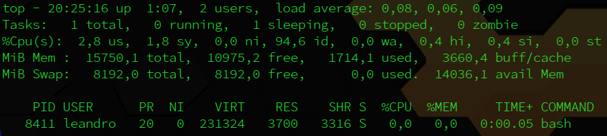
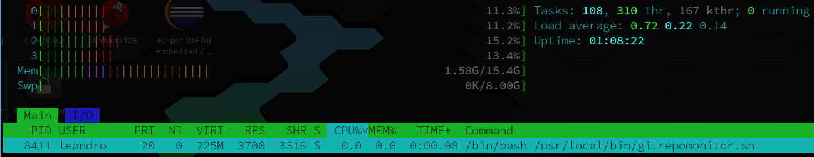

# gitrepomonitor - Git Repository Monitor

The gitrepomonitor is a shell script program that run as a daemon service on Linux.

The purpose for this project is to automate the update procedures to let the local repositories up to date with online github repositories.

To do it, this daemon read a file with a list of personal github repositories names, check each one to find out of date repository, if someone in file list is out of date and need to be syncronized to online github account, the script run all commands to add all untracked, deleted or changed local files, commit with a formatted message (formatted message + date and time) and push all to online git repository respectively and automated.

The ideas to build this project came from the repository daemons that store this project and dive deeply into the concepts and architecture of deamons on Linux system. All projects and ideas was built thinking for Linux Operating System, but with few changes all of them can be run on others OS too.

Following the daemons project documents, I include some usefull information about daemon concept and its algoritms, source code format and how it could be implemented, these information was taken from others blogs and articles that teatch about how to create and implement a simple program (binary) or script (shell, python, perl, etc) to run as a daemon service on Linux system.

[daemons](https://github.com/LeandroHuff/daemons)

TOP result:

HTOP result:

